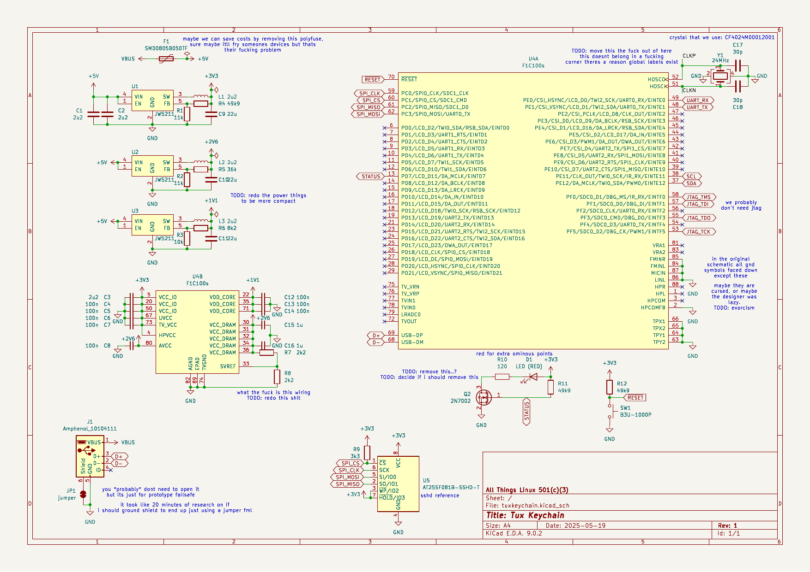
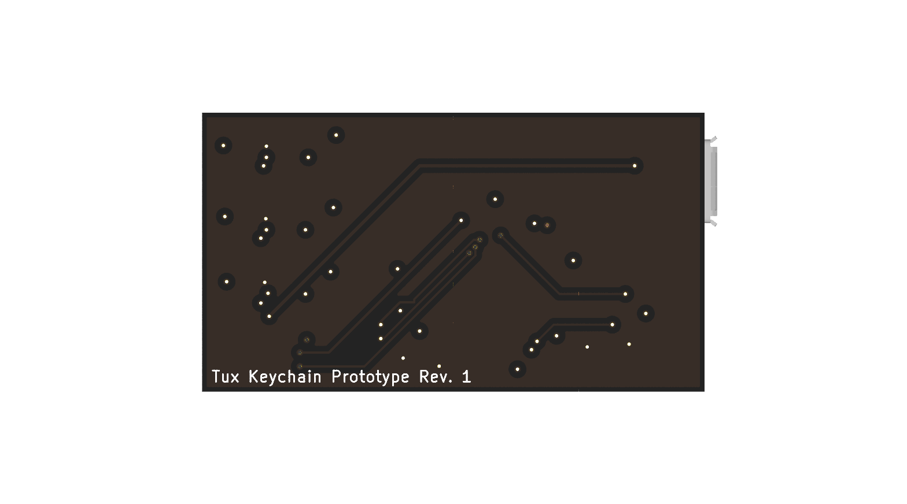

# Tux Keychain
Keychain shaped like Tux, the Linux mascot. But it's not just a keychain, it runs embedded Linux!

Unfortunately this is more expensive than usual due to tariffs and inflation. (Probably cheaper in other countries.)

NOTE: This is still in the prototype stage, changes to the design are likely. It doesn't even look like Tux yet!

## Manufacturing
- This is a 4-layer PCB so it can fit in the Tux keychain form factor.
- Make sure you use ENIG for the PCB finish, else Tux will be gray instead of gold. (If you want a gray Tux, seek help.)
- This is designed for JLCPCBs assembly service, some parts are LCSC exclusive*.

*You can probably find them on other chinese distributors, but I don't know which ones.

## Attribution
The Allwinner F1C100s footprint/symbol is from https://github.com/thirtythreeforty/3340_kicad (F1C100s symbol, QFN-88_EP_10x10_Pitch0.4mm footprint).
Same for the JW5211 symbol and footprint.

Schematic heavily based on the business card design by thirtythreeforty (https://www.thirtythreeforty.net/posts/2019/12/my-business-card-runs-linux/businesscard.pdf).

Tux attribution: [lewing@isc.tamu.edu](https://isc.tamu.edu/~lewing/linux/) (Larry Ewing) and [The GIMP](https://www.gimp.org/).

## Images
|PCB|Schematic|
|---|---|
|||
|||  

## Capabilities
Generated from [the linux-sunxi wiki](https://linux-sunxi.org/Linux_mainlining_effort). Last updated May 20, 2025.
This does not mean that you just cannot do some of these things, you can probably with enough effort.

### Legend
<table style="text-align: center;">
  <tr><th>Legend</th></tr>
  <tr><td style="background: darkgreen;">In Linux mainline since version x</td></tr>
  <tr><td style="background: darkblue;">Nobody works on it, but it should be compatible with already done drivers</td></tr>
  <tr><td style="background: orange;">Somebody works on it</td></tr>
  <tr><td style="background: red;">No support, nobody works on it</td></tr>
  <tr><td style="background: black; color: white;">Support impossible</td></tr>
  <tr><td style="background: grey; color: white;">Status is unknown/to be completed</td></tr>
</table>

### Capabilities
<table style="width:100%; text-align: center; border-collapse: collapse;">
  <tr>
    <th>Model</th><th>Subsystem</th><th>Feature</th><th>Status</th>
  </tr>
  <tr><td>F1C-100s/200s</td><td>ADC</td><td>GPADC</td><td style="background: grey; color: white;">N/A</td></tr>
  <tr><td>F1C-100s/200s</td><td>ADC</td><td>LRADC</td><td style="background: darkgreen;">6.2</td></tr>
  <tr><td>F1C-100s/200s</td><td>ADC</td><td>Thermal</td><td style="background: red; color: white;">NO</td></tr>
  <tr><td>F1C-100s/200s</td><td>ADC</td><td>Touch</td><td style="background: red; color: white;">NO</td></tr>
  <tr><td>F1C-100s/200s</td><td>Audio</td><td>AC97</td><td style="background: grey; color: white;">N/A</td></tr>
  <tr><td>F1C-100s/200s</td><td>Audio</td><td>Audio Codec</td><td style="background: orange;">WIP</td></tr>
  <tr><td>F1C-100s/200s</td><td>Audio</td><td>Audio Hub</td><td style="background: grey; color: white;">N/A</td></tr>
  <tr><td>F1C-100s/200s</td><td>Audio</td><td>DMIC</td><td style="background: grey; color: white;">N/A</td></tr>
  <tr><td>F1C-100s/200s</td><td>Audio</td><td>I2S</td><td style="background: red; color: white;">NO</td></tr>
  <tr><td>F1C-100s/200s</td><td>Audio</td><td>SPDIF</td><td style="background: red; color: white;">NO</td></tr>
  <tr><td>F1C-100s/200s</td><td>Camera</td><td>BT656</td><td style="background: red; color: white;">NO</td></tr>
  <tr><td>F1C-100s/200s</td><td>Camera</td><td>ISP</td><td style="background: grey; color: white;">N/A</td></tr>
  <tr><td>F1C-100s/200s</td><td>Camera</td><td>MIPI CSI-2</td><td style="background: grey; color: white;">N/A</td></tr>
  <tr><td>F1C-100s/200s</td><td>Camera</td><td>Parallel</td><td style="background: red; color: white;">NO</td></tr>
  <tr><td>F1C-100s/200s</td><td>CAN bus</td><td colspan="2" style="background: grey; color: white;">?</td></tr>
  <tr><td>F1C-100s/200s</td><td>Clocks</td><td colspan="2" style="background: darkgreen;">5.0</td></tr>
  <tr><td>F1C-100s/200s</td><td>CPUFreq (DVFS)</td><td colspan="2" style="background: red; color: white;">NO</td></tr>
  <tr><td>F1C-100s/200s</td><td>CPUIdle</td><td colspan="2" style="background: red; color: white;">NO</td></tr>
  <tr><td>F1C-100s/200s</td><td>Crypto</td><td colspan="2" style="background: grey; color: white;">N/A</td></tr>
  <tr><td>F1C-100s/200s</td><td>Display (DRM)</td><td>CVBS</td><td style="background: red; color: white;">NO</td></tr>
  <tr><td>F1C-100s/200s</td><td>Display (DRM)</td><td>G2D</td><td style="background: grey; color: white;">?</td></tr>
  <tr><td>F1C-100s/200s</td><td>Display (DRM)</td><td>HDMI Audio</td><td style="background: grey; color: white;">N/A</td></tr>
  <tr><td>F1C-100s/200s</td><td>Display (DRM)</td><td>HDMI CEC</td><td style="background: grey; color: white;">N/A</td></tr>
  <tr><td>F1C-100s/200s</td><td>Display (DRM)</td><td>HDMI Video</td><td style="background: grey; color: white;">N/A</td></tr>
  <tr><td>F1C-100s/200s</td><td>Display (DRM)</td><td>LVDS</td><td style="background: grey; color: white;">N/A</td></tr>
  <tr><td>F1C-100s/200s</td><td>Display (DRM)</td><td>MIPI DSI</td><td style="background: grey; color: white;">N/A</td></tr>
  <tr><td>F1C-100s/200s</td><td>Display (DRM)</td><td>RGB</td><td style="background: red; color: white;">NO</td></tr>
  <tr><td>F1C-100s/200s</td><td>Display (DRM)</td><td>VGA</td><td style="background: grey; color: white;">N/A</td></tr>
  <tr><td>F1C-100s/200s</td><td>Display (SimpleFB)</td><td colspan="2" style="background: red; color: white;">NO</td></tr>
  <tr><td>F1C-100s/200s</td><td>DMA</td><td colspan="2" style="background: orange;">WIP</td></tr>
  <tr><td>F1C-100s/200s</td><td>Ethernet</td><td>EMAC</td><td style="background: grey; color: white;">N/A</td></tr>
  <tr><td>F1C-100s/200s</td><td>Ethernet</td><td>GMAC</td><td style="background: grey; color: white;">N/A</td></tr>
  <tr><td>F1C-100s/200s</td><td>GPU (3D)</td><td>Mali</td><td style="background: grey; color: white;">N/A</td></tr>
  <tr><td>F1C-100s/200s</td><td>GPU (3D)</td><td>PowerVR</td><td style="background: grey; color: white;">N/A</td></tr>
  <tr><td>F1C-100s/200s</td><td>HW Spinlocks</td><td colspan="2" style="background: grey; color: white;">N/A</td></tr>
  <tr><td>F1C-100s/200s</td><td>I2C</td><td colspan="2" style="background: darkgreen;">6.2</td></tr>
  <tr><td>F1C-100s/200s</td><td>IOMMU</td><td colspan="2" style="background: grey; color: white;">N/A</td></tr>
  <tr><td>F1C-100s/200s</td><td>IR</td><td>IR RX</td><td style="background: darkgreen;">6.2</td></tr>
  <tr><td>F1C-100s/200s</td><td>IR</td><td>IR TX</td><td style="background: grey; color: white;">?</td></tr>
  <tr><td>F1C-100s/200s</td><td>Keypad</td><td colspan="2" style="background: grey; color: white;">N/A</td></tr>
  <tr><td>F1C-100s/200s</td><td>LDOs</td><td colspan="2" style="background: grey; color: white;">?</td></tr>
  <tr><td>F1C-100s/200s</td><td>LEDC</td><td colspan="2" style="background: grey; color: white;">N/A</td></tr>
  <tr><td>F1C-100s/200s</td><td>MBUS</td><td colspan="2" style="background: grey; color: white;">?</td></tr>
  <tr><td>F1C-100s/200s</td><td>MsgBox</td><td colspan="2" style="background: grey; color: white;">N/A</td></tr>
  <tr><td>F1C-100s/200s</td><td>PCIe</td><td colspan="2" style="background: grey; color: white;">N/A</td></tr>
  <tr><td>F1C-100s/200s</td><td>Pinctrl</td><td colspan="2" style="background: darkgreen;">5.0</td></tr>
  <tr><td>F1C-100s/200s</td><td>PMU</td><td colspan="2" style="background: grey; color: white;">N/A</td></tr>
  <tr><td>F1C-100s/200s</td><td>PWM</td><td colspan="2" style="background: darkgreen;">6.2</td></tr>
  <tr><td>F1C-100s/200s</td><td>Remoteproc</td><td>AIPU</td><td style="background: grey; color: white;">N/A</td></tr>
  <tr><td>F1C-100s/200s</td><td>Remoteproc</td><td>DSP</td><td style="background: grey; color: white;">N/A</td></tr>
  <tr><td>F1C-100s/200s</td><td>RSB</td><td colspan="2" style="background: red; color: white;">NO</td></tr>
  <tr><td>F1C-100s/200s</td><td>RTC</td><td colspan="2" style="background: grey; color: white;">N/A</td></tr>
  <tr><td>F1C-100s/200s</td><td>SID (eFuse)</td><td colspan="2" style="background: grey; color: white;">?</td></tr>
  <tr><td>F1C-100s/200s</td><td>SMP</td><td colspan="2" style="background: grey; color: white;">N/A</td></tr>
  <tr><td>F1C-100s/200s</td><td>SPI</td><td colspan="2" style="background: darkgreen;">5.19</td></tr>
  <tr><td>F1C-100s/200s</td><td>SRAM</td><td colspan="2" style="background: darkgreen;">5.0</td></tr>
  <tr><td>F1C-100s/200s</td><td>Storage</td><td>EMCE</td><td style="background: grey; color: white;">N/A</td></tr>
  <tr><td>F1C-100s/200s</td><td>Storage</td><td>NAND</td><td style="background: grey; color: white;">N/A</td></tr>
  <tr><td>F1C-100s/200s</td><td>Storage</td><td>SATA</td><td style="background: grey; color: white;">N/A</td></tr>
  <tr><td>F1C-100s/200s</td><td>Storage</td><td>SD/MMC</td><td style="background: darkgreen;">5.19</td></tr>
  <tr><td>F1C-100s/200s</td><td>Timer</td><td>Arch Timer</td><td style="background: grey; color: white;">N/A</td></tr>
  <tr><td>F1C-100s/200s</td><td>Timer</td><td>HSTIMER</td><td style="background: grey; color: white;">?</td></tr>
  <tr><td>F1C-100s/200s</td><td>Timer</td><td>TIMER</td><td style="background: darkgreen;">5.0</td></tr>
  <tr><td>F1C-100s/200s</td><td>USB</td><td>USB</td><td style="background: darkgreen;">6.3</td></tr>
  <tr><td>F1C-100s/200s</td><td>USB</td><td>USB OTG</td><td style="background: darkgreen;">6.3</td></tr>
  <tr><td>F1C-100s/200s</td><td>USB</td><td>USB3</td><td style="background: grey; color: white;">N/A</td></tr>
  <tr><td>F1C-100s/200s</td><td>Video Engine</td><td colspan="2" style="background: red; color: white;">NO</td></tr>
  <tr><td>F1C-100s/200s</td><td>Watchdog</td><td colspan="2" style="background: darkgreen;">5.19</td></tr>
</table>
